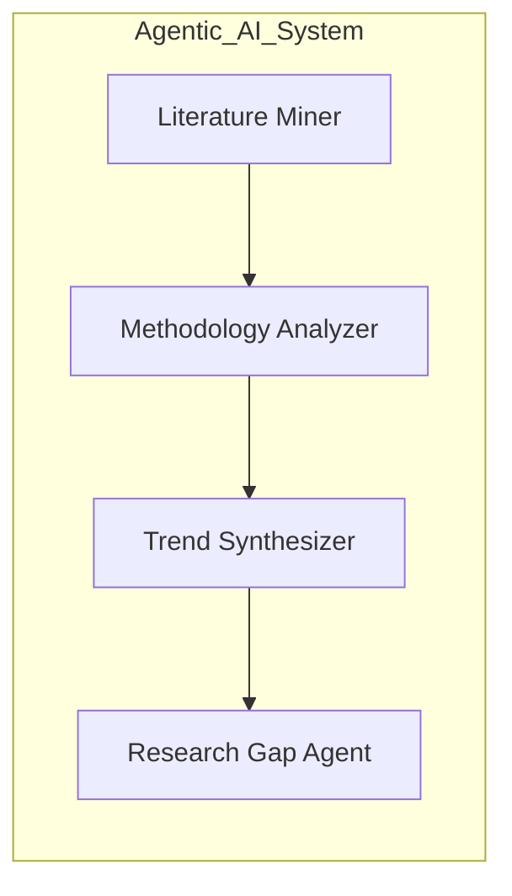
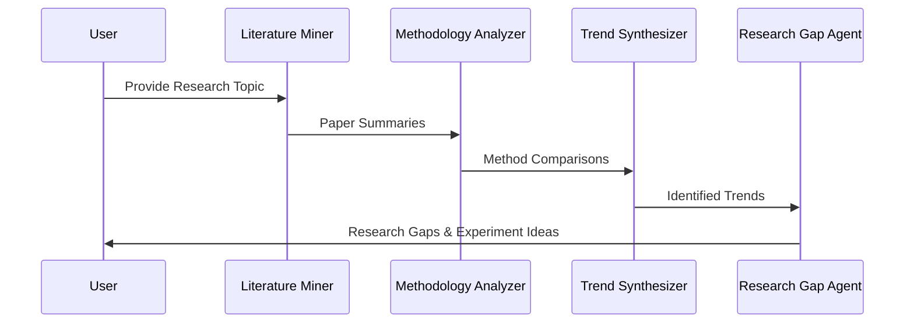
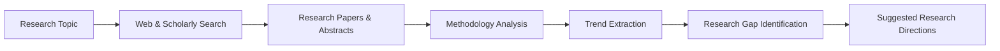

# 🧠 Autonomous Agentic AI System for Scientific Literature Intelligence & Research Gap Discovery

> A research-grade multi-agent AI system that simulates how researchers explore literature, analyze methodologies, synthesize trends, and identify open research problems.

---

## 🚀 Introduction

Conducting a high-quality literature review is a time-consuming and cognitively demanding process involving:
- Discovering relevant research papers
- Comparing methodologies
- Identifying emerging trends
- Finding under-explored research gaps

This project introduces an **autonomous agent-based AI system** that models the **academic research workflow** using multiple collaborating AI agents.  
Instead of a single chatbot, the system decomposes research into **specialized reasoning stages**, closely mirroring how real research groups operate.

---

## ✨ Key Features

- 🤖 Multi-agent architecture using **CrewAI**
- 📚 Automated literature discovery via **Serper API** and **arXiv**
- 🧩 Role-specific reasoning agents
- 🔗 Task chaining & prompt-driven orchestration
- 🔍 Research gap discovery with experiment suggestions
- ⚡ Fast inference using **Groq-hosted LLaMA 3.1 models**

---

## 🧩 Agent Roles & Responsibilities



| Agent | Responsibility |
|------|---------------|
| **Literature Miner** | Discovers relevant research papers and extracts key contributions |
| **Methodology Analyzer** | Compares techniques, models, datasets, and evaluation strategies |
| **Trend Synthesizer** | Identifies dominant patterns and emerging research directions |
| **Research Gap Agent** | Proposes under-explored problems and potential experiments |

---

## 🔁 Research Reasoning Pipeline



---

## 📊 Data Flow



---

## 🛠️ Tech Stack

- **Programming Language:** Python  
- **Agent Framework:** CrewAI  
- **LLMs:** Groq (LLaMA 3.1 family)  
- **Search & Retrieval:** Serper API, ScrapeWebsiteTool  
- **Scholarly Sources:** arXiv (open-access)  
- **Reasoning:** Prompt engineering & task chaining  

---

## ⚙️ Installation & Setup

### 1️⃣ Clone the Repository
```bash
git clone https://github.com/your-username/agentic-research-intelligence.git
cd agentic-research-intelligence
```

### 2️⃣ Install Dependencies
```bash
pip install numpy==1.26.4
pip install crewai==0.28.8 crewai_tools==0.1.6 langchain_groq==0.1.5 arxiv
```

### 3️⃣ Set Environment Variables
```bash
export GROQ_API_KEY="your_groq_api_key"
export SERPER_API_KEY="your_serper_api_key"
```

---

## ▶️ Usage

```python
result = research_crew.kickoff(
    inputs={"topic": "Large Language Models for Code Generation"}
)

print(result.raw)
```

---

## 📌 Example Output

```text
Research Gap:
Most current LLM-based code generation systems focus on benchmark accuracy,
while robustness to adversarial prompts remains under-explored.

Suggested Experiment:
Evaluate model robustness using synthetically perturbed code prompts
and measure performance degradation.
```

---

## 🎓 Why This Project Matters

- Demonstrates **agent-based AI system design**, not simple prompt usage  
- Models **real academic research workflows**  
- Emphasizes **structured reasoning and interpretability**  
- Uses **ethical, open-access data sources**  

**Highly relevant to:**
- Graduate research
- Agentic AI systems
- Research automation and decision support

---

## 🚫 Limitations

- Does not replace human researchers  
- Does not automatically publish research  
- Provides decision support, not guaranteed discoveries  

---

## 🔮 Future Work

- Citation graph analysis  
- PDF-level paper parsing  
- Multi-topic batch analysis  
- Evaluation against expert-written surveys  
- Integration with LaTeX / Overleaf  

---

## 📄 Resume / SOP Description

Developed an autonomous multi-agent AI system that simulates the academic research workflow, enabling literature discovery, methodology analysis, trend synthesis, and research gap identification using agent-based reasoning.

---

## ⭐ Acknowledgements

- CrewAI for agent orchestration  
- Groq for high-speed LLM inference  
- arXiv for open-access research  

---

## 🏁 Final Note

This project explores how **agentic AI systems can assist—not replace—scientific discovery** by structuring complex reasoning tasks into interpretable, modular components.
